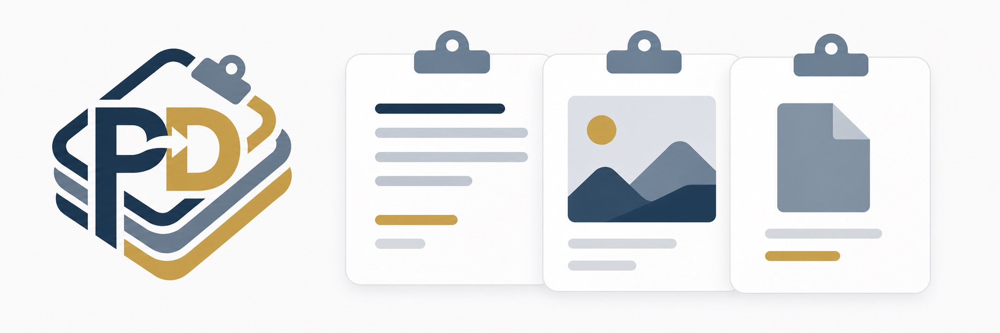

<p align="center">
  
</p>

<h1 align="center">PasteDeck</h1>

<p align="center">快速、私密、开源的 macOS 剪贴板历史工具</p>

<p align="center">
  <strong>简体中文</strong> · <a href="README.en.md">English</a>
</p>

<p align="center">
  <a href="https://github.com/jeffusion/PasteDeck/actions/workflows/ci.yml"></a>
  <a href="https://github.com/jeffusion/PasteDeck/releases/latest"></a>
  
  <a href="LICENSE"></a>
</p>

PasteDeck 使用 SwiftUI 和 AppKit 构建，帮助你快速找回最近复制过的文本、图片和文件。它可以通过全局快捷键随时打开，数据保存在本机，不包含遥测。

## 主要功能

- 记录文本、图片和文件类型的剪贴板内容
- 使用 `Command + Shift + V` 快速打开剪贴板面板
- 搜索、收藏、置顶和删除历史记录
- 在列表与网格视图之间切换
- 排除不应记录剪贴板内容的应用
- 使用本机 Core Data 存储，不上传使用数据
- 支持简体中文、英语、日语和俄语

## 安装

从 [GitHub Releases](https://github.com/jeffusion/PasteDeck/releases/latest) 下载最新版本。DMG 和 ZIP 都包含同时支持 Apple Silicon 与 Intel Mac 的 universal app。

使用 DMG 安装：

1. 下载并打开 `PasteDeck-x.y.z.dmg`。
2. 将 `PasteDeck.app` 拖入 `Applications`。
3. 从“应用程序”文件夹启动 PasteDeck。

> [!IMPORTANT]
> PasteDeck 采用完全开源、无需 Apple 开发者账号的发布方式，因此没有 Developer ID 签名和 Apple 公证。macOS 首次启动时会阻止未知开发者应用。确认下载来源和 SHA-256 后，请前往“系统设置 → 隐私与安全性”，选择“仍要打开”。不要全局关闭 Gatekeeper。

校验下载文件：

```bash
shasum -a 256 -c PasteDeck-x.y.z.dmg.sha256
```

## 使用方式

1. 启动 PasteDeck，并根据系统提示授予必要权限。
2. 正常复制文本、图片或文件。
3. 按下 `Command + Shift + V` 打开历史面板。
4. 搜索或选择需要的记录，也可以收藏、置顶或删除它。

## 隐私边界

- 剪贴板历史保存在当前 Mac 的 Core Data 数据库中。
- PasteDeck 不包含遥测，也不会将剪贴板内容上传到服务器。
- 当前版本不提供 iCloud 同步。
- 本地数据库没有额外加密；能够访问当前 macOS 用户数据的人也可能读取该数据库。

## 系统要求

- macOS 13 Ventura 或更高版本
- Apple Silicon 或 Intel Mac
- 从源码构建需要 Xcode 16 或更高版本

## 从源码构建

```bash
git clone https://github.com/jeffusion/PasteDeck.git
cd PasteDeck
make test
make app
make run
```

常用命令：

| 命令 | 用途 |
| --- | --- |
| `make test` | 运行 Xcode 测试套件 |
| `make app` | 构建并 ad-hoc 签名 `dist/PasteDeck.app` |
| `make verify` | 验证应用资源、架构和代码签名 |
| `make dist` | 生成 ZIP、DMG 和 SHA-256 文件 |
| `make run` | 构建并运行应用 |
| `make clean` | 清理本地构建产物 |

也可以直接在 Xcode 中打开 `PasteDeck.xcodeproj`。`project.yml` 是 XcodeGen 工程源配置；修改 target、依赖、资源或构建设置后，需要运行 `xcodegen generate` 并同时提交生成的工程文件。

## 项目结构

```text
PasteDeck/
|-- PasteDeck.xcodeproj/           Xcode macOS Application 工程
|-- project.yml                    XcodeGen 工程源配置
|-- Config/Info.plist              应用 bundle 元数据
|-- Sources/PasteDeck/             应用源码
|-- Sources/Resources/             本地化资源
|-- Tests/PasteDeckTests/          单元测试
|-- Resources/                     应用图标
|-- script/                        构建、打包与验证脚本
|-- .github/workflows/ci.yml       持续集成
`-- .github/workflows/release.yml  自动发布
```

## 发布方式

推送语义化版本标签会触发 GitHub Actions：

```bash
git tag v1.2.3
git push origin v1.2.3
```

Release 工作流会运行测试、构建 `arm64 + x86_64` universal app、执行 ad-hoc 签名与结构验证，并发布 DMG、ZIP 和各自的 SHA-256 文件。整个过程只使用仓库内置的 `GITHUB_TOKEN`，不需要任何 Apple 凭据。

详细说明见 [分发指南](Docs/Development/DISTRIBUTION.md)。

## 参与贡献

Issue 和 Pull Request 都欢迎提交。开始前请阅读 [贡献指南](CONTRIBUTING.md)。

## 路线图

- iCloud 同步
- 导入与导出
- 自动更新
- 可选的 Developer ID 签名与公证

## 许可证

PasteDeck 使用 [MIT 许可证](LICENSE) 发布。
